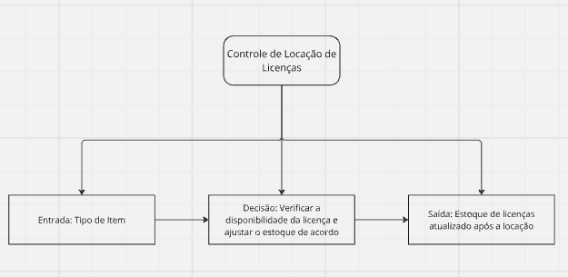
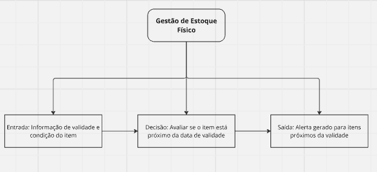
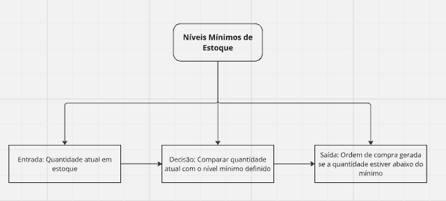
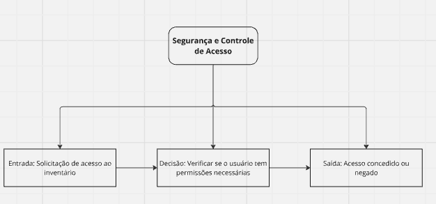
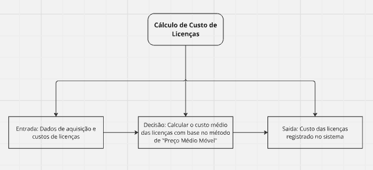

# Representação de Regras de Negócio com DMN

## 👤 **Integrante:**

- [Izadora Luz](https://www.linkedin.com/in/izadoraluz-rsn/)

## 👨‍🏫 **Professores:**

- [Renato Penha](https://www.linkedin.com/in/renato-penha/) - Professor orientador
- [Afonso Cesar](https://www.linkedin.com/in/afonsolelis/) - Professor de programação

## **📝 Descrição**

Este projeto tem como objetivo elaborar e modelar regras de decisão utilizando a linguagem DMN (Decision Model and Notation), uma linguagem padronizada para modelar e automatizar decisões de negócios. A DMN facilita a representação de decisões em processos, usando tabelas de decisão e regras de negócio, o que permite uma compreensão e automação mais claras de processos complexos.

### Objetivos da Atividade:
1. Elaborar regras de decisão do negócio da empresa: Criar regras de decisão em linguagem natural que sejam relevantes para o negócio da empresa, garantindo que todas sigam um padrão de linguagem consistente e compreensível.

2. Criar um modelo DMN: Desenvolver um modelo em DMN para uma situação de decisão no processo que foi modelado pelo grupo, utilizando uma ou mais das regras de decisão elaboradas.

### Contexto da Empresa

A empresa em análise, G2 Tecnologia, é parceira da SAP e fornece o ERP SAP Business One, focado em otimizar a gestão de pequenas e médias empresas. Para mais informações sobre a empresa, visite o [site institucional](https://g2tecnologia.com.br/quem-somos/).

## **📁 Estrutura de pastas**

- `images/`: Pasta com as imagens dos fluxos
- `README.md`: Documentação do projeto.

## 🗂️ **Regras de Negócios**

Aqui está um conjunto de Regras de Negócios para o sistema SAP relacionado à área de estoque da G2 Tecnologia, todas validadas com o cliente no dia 23 de agosto:

| N°    | Descrição                        | Critérios de Aplicação                                                                   | Ações                                                                                 | Responsável      | Observações        |
|-------|----------------------------------|------------------------------------------------------------------------------------------|---------------------------------------------------------------------------------------|------------------|--------------------|
| ESOO1 | **Controle de Locação de Licenças** | Aplicável a todas as licenças locadas para clientes.                                      | Criar uma ordem de saída no sistema para cada locação de licença, ajustando o estoque disponível. | Área de Estoque  | Faz sentido        |
| ESOO2 | **Gestão de Estoque Físico**       | Aplicável a todos os materiais físicos (ex.: papelaria).                                  | Monitorar a validade e condição dos itens. Itens com validade próxima devem gerar um alerta automático. | Área de Estoque  |                    |
| ESOO3 | **Níveis Mínimos de Estoque**      | Aplicável a todos os itens de estoque, tanto materiais quanto licenças de software.       | Definir níveis mínimos de estoque. Quando o estoque cair abaixo do mínimo, gerar automaticamente uma ordem de compra. | Área de Estoque  |                    |
| ESOO4 | **Segurança e Controle de Acesso** | Aplicável a todo o inventário, com ênfase em licenças de software.                        | Controlar o acesso ao inventário com permissões específicas. Acessos devem ser registrados e auditados regularmente. | Área de Estoque  |                    |
| ESOO5 | **Cálculo de Custo de Licenças**   | Aplicável a todas as licenças de software no estoque.                                     | Utilizar o método de "Preço Médio Móvel" para a valorização das licenças no estoque. Registrar todos os custos associados. | Área de Estoque  |                    |

## 📊 **Diagramas DMN**

Os diagramas a seguir representam as decisões modeladas em DMN para o processo de gerenciamento de estoque da empresa G2 Tecnologia, utilizando as regras de negócio descritas acima. Cada diagrama visualiza como as decisões são tomadas com base em diferentes condições e regras aplicáveis.

### Diagrama 1: Controle de Locação de Licenças

Figura 1 - Controle de Locação de Licenças

Fonte: Material produzido pelo autor (2024)

### Diagrama 2: Gestão de Estoque Físico

Figura 2 - Gestão de Estoque Físico

Fonte: Material produzido pelo autor (2024)

### Diagrama 3: Níveis Mínimos de Estoque

Figura 3 - Níveis Mínimos de Estoque

Fonte: Material produzido pelo autor (2024)

### Diagrama 4: Segurança e Controle de Acesso

Figura 4 - Segurança e Controle de Acesso

Fonte: Material produzido pelo autor (2024)

### Diagrama 5: Cálculo de Custo de Licenças

Figura 5 - Cálculo de Custo de Licenças

Fonte: Material produzido pelo autor (2024)

