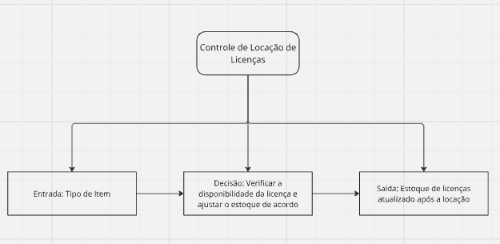
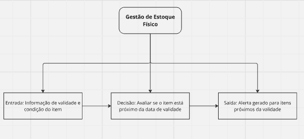
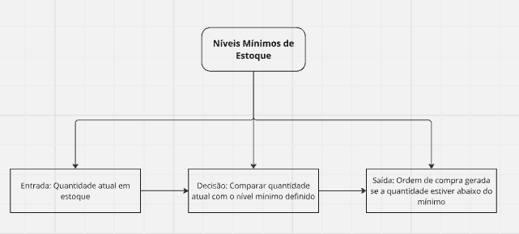
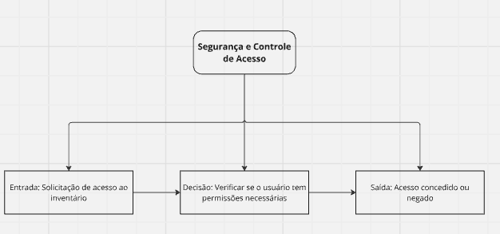
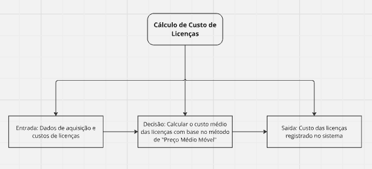

# Regras de Negócio

Aqui está um conjunto de Regras de Negócios para o sistema SAP relacionado à área de estoque da G2 Tecnologia, todas validadas com o cliente no dia 23 de agosto:

| N° | Descrição | Critérios de Aplicação | Ações | Responsável |  |
| --- | --- | --- | --- | --- | --- |
| ESOO1 | **Controle de Locação de Licenças** | Aplicável a todas as licenças locadas para clientes. | Criar uma ordem de saída no sistema para cada locação de licença, garantindo que o estoque disponível seja ajustado. | Área de Estoque | Faz sentido |
| ESOO2 | **Gestão de Estoque Físico** | Aplicável a todos os materiais físicos (ex.: papelaria). | Monitorar a validade e condição dos itens. Itens com validade próxima devem gerar um alerta automático. | Área de Estoque |  |
| ESOO3 | **Níveis Mínimos de Estoque** | Aplicável a todos os itens de estoque, tanto materiais quanto licenças de software. | Definir níveis mínimos de estoque. Quando o estoque cair abaixo do mínimo, gerar automaticamente uma ordem de compra. | Área de Estoque |  |
| ESOO4 | **Segurança e Controle de Acesso** | Aplicável a todo o inventário, com ênfase em licenças de software. | Controlar o acesso ao inventário com permissões específicas. Acessos devem ser registrados e auditados regularmente. | Área de Estoque |  |
| ESOO5 | **Cálculo de Custo de Licenças** | Aplicável a todas as licenças de software no estoque. | Utilizar o método de "Preço Médio Móvel" para a valorização das licenças no estoque. Registrar todos os custos associados. | Área de Estoque |  |  |

## Diagramas DMN

